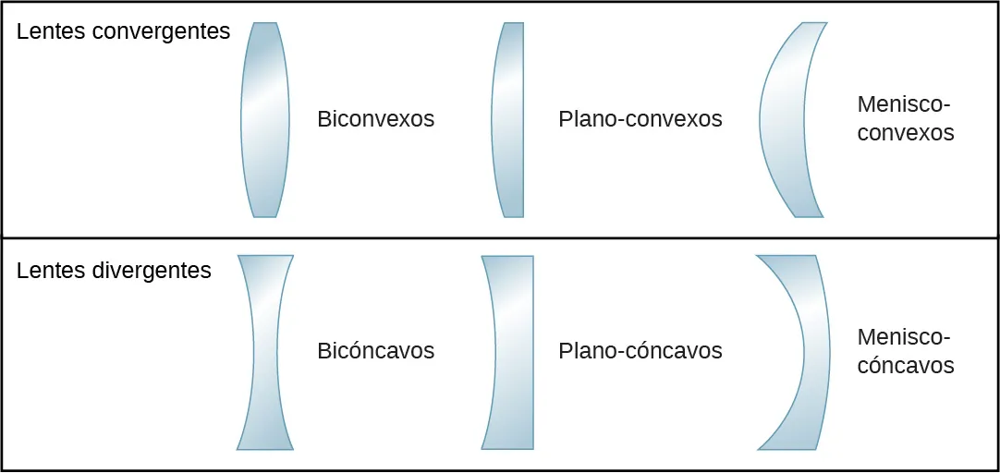

<!doctype html>
<html lang="es">
<head>
  <meta charset="utf-8" />
  <meta name="viewport" content="width=device-width,initial-scale=1" />
  <title>Lentes delgadas — Interactivo ligero</title>
  <link href="https://fonts.googleapis.com/css2?family=Inter:wght@300;600&family=Press+Start+2P&display=swap" rel="stylesheet">
  
</head>
<body>
  <header>
    
<h1>LENTES</h1>

    

      
Lentes delgadas — Interactivo ligero

      
Simulador optimizado — mueve controles o anima con espacio

    

    <nav>
      <button id="btnIntro">Inicio</button>
      <button id="btnTipos">Tipos</button>
      <button id="btnForm">Fórmulas</button>
    </nav>
  </header>

  <main class="wrap">
    <section class="panel canvas-wrap" aria-labelledby="sim-title">
      <h3 id="sim-title">Simulador de rayos (Optimizado y Corregido)</h3>
      <canvas id="scene" width="900" height="420" aria-label="Simulador de lentes"></canvas>

      

        <label>Tipo:
          <select id="lensType">
            <option value="convergent">Convergente (convexa)</option>
            <option value="divergent">Divergente (cóncava)</option>
          </select>
        </label>
        <label>F (px): <input id="fRange" type="range" min="60" max="300" value="140"></label>
        <label>d_o (px): <input id="doRange" type="range" min="60" max="700" value="320"></label>
        <label><input id="showLabels" type="checkbox" checked> Mostrar etiquetas</label>
        <button id="toggleAnim" class="primary">Iniciar animación</button>
        <button id="resetBtn">Reset</button>
      

      

        
Resultados: —

        

          <strong>Instrucciones</strong>
          
Usa los controles para cambiar la lente y las distancias. Presiona espacio para iniciar/detener la animación.

        

      

    </section>

    <aside class="aside">
      

        <h4>Tipos de lentes</h4>
        

          
        

        
Las lentes delgadas se clasifican en convergentes y divergentes. Las convergentes enfocan rayos paralelos; las divergentes los dispersan.

      

      

        <h4>Fórmula y Ejemplos</h4>
        
        

          1/<strong>f</strong> = 1/<strong>do</strong> + 1/<strong>di</strong>
        

        
        <strong style="font-size: 14px; color: var(--muted); margin-left: 4px;">Casos Principales:</strong>
        
        

          

          
<strong>Conv. (do > f)</strong> Real, Invertida

        

        

          

          
<strong>Conv. (do < f)</strong> Virtual, Derecha

        

        

          

          
<strong>Divergente</strong> Virtual, Derecha, Menor

        

      

    </aside>
  </main>

  <footer style="padding:12px">Simulador optimizado para bajo consumo de recursos.</footer>

  
</body>
</html>
